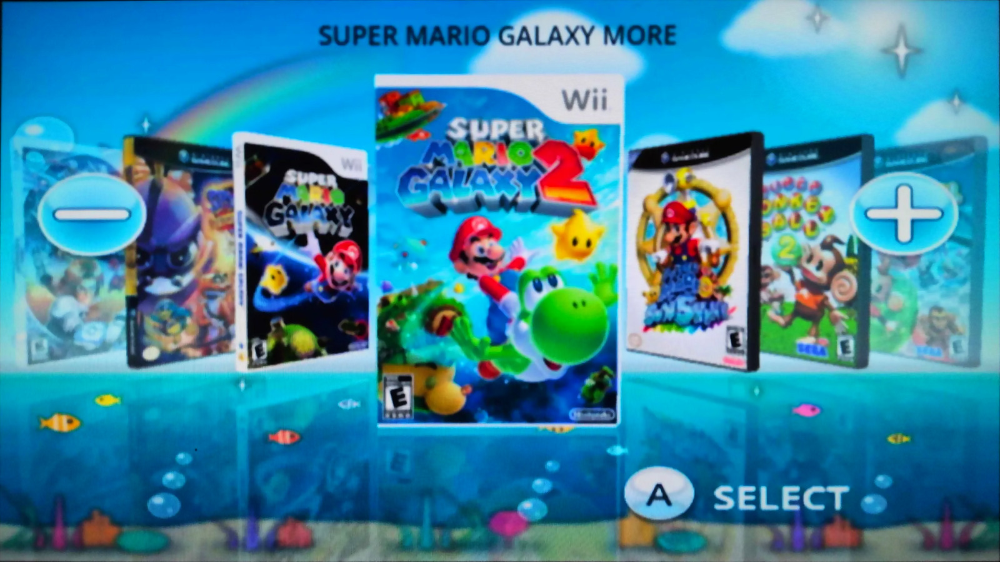

  

# WiiFlow Kids

A fork of [WiiFlow Lite](https://github.com/Fledge68/WiiFlow_Lite) stripped down to
one screen a young child can use on their own.

Point at a game, press **A**, press **PLAY**. That is the whole interface.

Wii and GameCube games sit together in one coverflow. There is no source menu, no
settings, no categories, no favorites and no delete — those screens are removed
from the build, not hidden. HOME exits.

## Install

Download the [latest release](https://github.com/gaavin/WiiFlow-Kids/releases/latest)
and extract it to the root of your SD card, then add your games:

    sd:/wbfs/<Title> [ID6]/<ID6>.wbfs      Wii
    sd:/games/<Title> [ID6]/game.ciso      GameCube

Launch it from the Homebrew Channel, or install `wad/WiiFlow_Kids_Channel.wad` for
a Wii Menu channel. The channel is a forwarder — it boots
`sd:/apps/wiiflow/boot.dol`, so updating later means replacing that one file.

Cover art is optional. It goes in `sd:/wiiflow/covers/<ID6>.png` (160x224) and
`sd:/wiiflow/boxcovers/<ID6>.png` (1024x680), both from
[GameTDB](https://www.gametdb.com), under the `wii` path for GameCube discs too.

## Opinionated by design

**Games come back here.** Pressing HOME in a game and choosing "Wii Menu" returns
to WiiFlow rather than the System Menu.

**The look ships inside `boot.dol`.** Background, buttons, arrows, typeface, theme
colours and the coverflow layout are all compiled in, so the build renders
correctly even if nothing but the dol reaches the card.

**Sized for a couch.** Type runs a few points larger than stock throughout.

## Configuring

There is no settings UI — edit the ini files by hand with WiiFlow closed:

| file | controls |
|---|---|
| `sd:/apps/wiiflow/wiiflow_lite.ini` | main config |
| `sd:/wiiflow/themes_lite/default.ini` | text colours and font sizes |
| `sd:/wiiflow/themes_lite/coverflows/default.ini` | cover layout and the view modes **1**/**2** cycle |

Anything in those files overrides the copy compiled into the dol. Delete a file and
the built-in takes over again, so a bad edit cannot lock you out.

## Building

    scripts/build.sh

`scripts/env.sh` locates GNU make and sets `DEVKITPRO`/`DEVKITPPC` (default
`/tmp/devkitpro/opt/devkitpro`). On aarch64 it runs the x86_64 toolchain under
box64 with `BOX64_DYNAREC=0`, because GCC 12 ICEs in libstdc++ constexpr with the
dynarec on. Everything else — libpng, freetype, wolfSSL, custom fat/ntfs/ext2 — is
vendored in `portlibs/` and `source/libwolfssl/`.

`scripts/package_release.sh` assembles the release zip. The artwork is generated,
not hand-drawn: `scripts/kids_background.py`, `kids_theme.py` and `kids_splash.py`
render the background, chrome and boot splash.

## Credits

[WiiFlow Lite](https://github.com/Fledge68/WiiFlow_Lite) by Fledge68, built on
WiiFlow by the original authors. Channel forwarder from
[wyndchyme/wiiflow-forwarder](https://github.com/wyndchyme/wiiflow-forwarder)
(Apache-2.0), retextured here. Cover art from GameTDB. Bundled typeface is Open
Sans (Apache-2.0).

## In motion

<video src="https://github.com/gaavin/WiiFlow-Kids/raw/kids-ui/docs/demo.mp4" controls width="100%"></video>

If the player does not load, [download the clip](docs/demo.mp4) — it is in the
repository at `docs/demo.mp4`.
